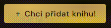
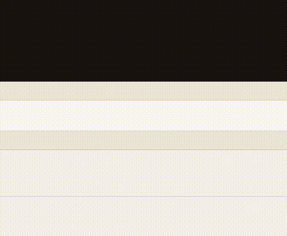
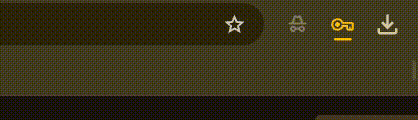

# AK - Adolescentní Knihovna 2026

Vítejte v **online** školní databázi uložených knih, kde se dají najít různé knihy ze školní knihovny!

### Jak postupovat u přidání knihy?

Aby jste mohli přidat knihu, tak musíte kliknout na tlačítko *`+ Chci přidat knihu!`*



Poté by se mělo objevit okénko, kde **zadáte heslo** :)



Jakmile zadáte kód, tak můžete začít přidávat informace o knize, kterou chcete přidat (Později by se mělo i přidat možnost k přidání fotek knihy)

Když už jste zadaly všechny nutné informace o knize, tak by se měl naistalovat soubor typu *`Název knihy.json`*



**Příklad naistalovaného souboru, který byl vygenerován:**
```ruby
{
  "stk": "01-03-YTDA",
  "title": "Na západní frontě klid (Též zkušební)",
  "author": "Erich Maria Remarque",
  "isbn": "",
  "year": "1928",
  "location": {
    "Budova": "Budova B"
  },
  "keywords": [
    "Válka",
    "Kamarádi",
    "Myšlenky"
  ],
  "matura": true,
  "cover": "",
  "contents": ""
}
```

### *Malá vsuvka...*.

Jelikož je projekt stále ve vývoji, tak ukládání knihy není automatické. Pokud soubor **.json** nedáte na GitHub, tak kniha v se po obnovení webu ztratí a tak ho musíte přidat do *`BOOK_FILES`* a dále do vybraného předmětu.
Po uložení a chvilce strpení by se kniha měla objevit na webu ;)

### Webovka

Stačí hopnout na [AK — Adolescentní Knihovna](https://jemolotrab.github.io/AK-Database/) a začít hledat nebo přidávat knihy...
