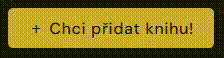

# AK - Adolescentní Knihovna 2026

Vítejte v **online** školní databázi knih, kde se dají najít různé knihy ze školní knihovny!

### Webovka

[AK — Adolescentní Knihovna](https://jemolotrab.github.io/AK-Database/)

### Zjednodušený postup pro přidání knihy

Aby jste mohli přidat knihu, tak musíte kliknout na tlačítko *`+ Chci přidat knihu!`*

Poté by se mělo objevit okénko, kde **zadáte heslo** :)

Jakmile zadáte kód, tak můžete začít přidávat informace o knize, kterou chcete přidat.

Když už jste zadaly všechny nutné informace o knize, tak by se měl naistalovat soubor typu *`Název knihy.zip`*

*`(v ukázce je naistalován soubor .json, což prosím ignorujte)`*

### Finální kroky...

Jelikož je projekt stále ve vývoji, tak ukládání knihy není automatické. Pokud soubor **knihy** nedáte na GitHub, tak kniha se po obnovení webu ztratí a tak musíte na webu kliknout na tlačítko *`GitHub`* a soubor přidat do *`BOOK_FILES`* a dále do vybraného předmětu. Celý soubor **knihy** obsahuje *`název_knihy.json`* a fotky, které jste nahráli *`(pro přidání souborů je potřeba mít povolení úpráv tohoto repozitáře)`*.

Po uložení a chvilce strpení by se všechno mělo objevit na webu ;)
