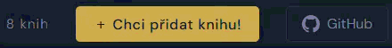
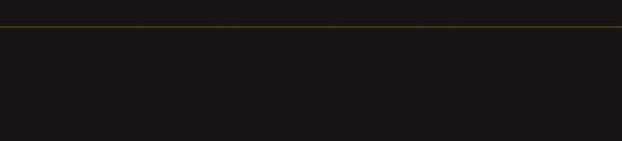
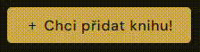
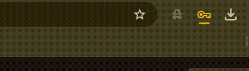

# AK - Adolescentní Knihovna [2026]
<!-- Toto README by mělo obsahovat víceméně všechny informace o AK. Taky by to mělo obsahovat nějaký "guide", který popíše postup při přidání / odebrání knihy - 14.09.26 (tento text není viditelný) -->

> [!WARNING]
> ***Tento projekt a zároveň i toto README je VELMI out of date! Tedy je možné, že se projekt může v blízké době výrazně pozměnit a README nemusí odpovídat realitě!***

Tento projekt se věnuje digitalizaci školních knih se základními informacemi do databáze dělané přes GitHub, kde kdokoliv může jak knihy prohlížet, tak i přidávat. Níže se vyskytuje více informaci pro porozumění celého projektu. <!-- By mě tak zajímalo, že kolik těchto skrytých textů tu dám -->

## Webovka
> [!NOTE]
> **Odkaz na web** ↴\
> [AK — Adolescentní Knihovna](https://jemolotrab.github.io/AK-Database/) <!-- BARTOLOMĚJ: "TENTO ODKAZ SE NESMÍ SAKRA ZTRATIT!!!" >:) -->

## Informace o projektu a jak to funguje

### Proč GitHub?
GitHub je prostor, ve kterém mohou existovat veškeré data potřebné pro tento projekt: samotný web (index.html, který GitHub hostuje) a složky obsahující knihy a fotky. Tedy nám GitHub umožní spoustu věcí.

* *Hostování webu a uložení souborů je plně zdarma.*
* *Každá úprava jakéhokoliv souboru je automaticky ukládána do historie, tedy omylem upravenou nebo smazánou knihu lze vždy vrátit.*
* *Data jsou obyčejné soubory (krátký JSON na knihu), které se snadno čtou, zálohují i přenášejí jinam.*

Jediným háčkem GitHubu je to, že weby z ní jsou statické. To znamená že GitHub sice umí data číst, ale nedokáže je sám ukládat. V takovém případě je potřeba vytvořit takzvaný GitHub token, který dovoluje každému kdo ho vlastní upravovat a přidávat data do daného repositáře. Problém ale je, že tento token se nesmí dát do kódu stránky, protože by si ho mohl přečíst naprosto kdokoliv a zneužít. Tedy ukládání knih do GitHubu je pouze možné přes manuální nahrávání do správné složky v repositáři.

### Propojení s Cloudflare Workerem
Naše řešení pro automatizaci ukládání knih na GitHub se jmenuje Cloudflare, kde si vytvoříme Cloudflare Workera (Cloudflare Assets (Non-Func)/worker.js), který bude stát mezi webem a GitHubem. Web tedy čte a načítá informace přímo z GitHubu a Cloudflare Worker pouze informace mění nebo přidává.

* *Uchovává tajné hodnoty a komprimuje je (GitHub token a heslo k editoru knih). Hodnoty jsou uložené na Cloudflare, nikdy v repositáři*
* *Kontroluje zadané informace a zapíše je na GitHub u přidání, úpravy a smazání knihy.*
* *Dokáže vyhledávat po internetu zadané ISBN v knihovních katalozích.*
* *Propojuje počítač a telefon při skenování.*

> [!CAUTION]
> ***Někdy se může stát, že spojení mezi webem, Cloudflarem a GitHubem selže. Může se jednat jak o připojení k internetu, tak i výpadku GitHubu nebo Cloudflaru, tak i vypršení tokenu potřebnému pro uprávu a předání dat na GitHub!***

Pokud uvidíš správu o selhání uložení knihy, tak kniha nebyla uložena a to co si napsal, je pryč. Tedy je nutné knihu zadat znova ;)

> [!IMPORTANT]
> ## Jak knihovnu používat
Normálně otevři web přes link. Pro použití knihovny není potřeba žádné přihlášení. Zatím...

* ***Hledání:** podle názvu knihy, jméno autora, klíčových slov, kódu STK a nebo ISBN.*
* 📷 ***ve vyhledávání:** vyhledání knihy naskenováním čárového kódu ISBN.*
* ***Filtry:** lze hledat knihy podle předmětu a kategorie (u češtiny je dodatečné zaškrtávací políčko maturitní četba)* <!-- Protože čeština -->
* ***Řazení:** výchozí, nejnovější nahoře, A → Z, Z → A.*
* 🎲 ***Náhodná kniha:** otevře náhodnou knihu z těch, co jsou zrovna zobrazené (chceš-li náhodnou dějepisnou knihu, nejdřív vyfiltruj historii).*
* ***Mřížka / seznam:** přepíná se tlačítky vedle hledání.*
* 📊 ***Statistiky:** přehled knihovny (knihy podle předmětů a budov, nejčastější autoři, nejnovější knihy) a export do Excelu: všechny knihy + statistiky, nebo jen právě zobrazené knihy.*

> [!IMPORTANT]
> ## Postup u přidání knihy
**[VŠECHNY INFORMACE POZMĚNIT. OPRAVDU]**\
Aby jste mohli přidat knihu, tak budete muset přejít na web a kliknout vpravo nahoře na tlačítko ***`+ Chci přidat knihu!`***. Uprostřed by se poté mělo objevit okénko, kde zadáte heslo (editor knihy je chráněn heslem z důvodu, že ten web je plně přístupný k celému internetu). Po zadání (správného) hesla by se měl objevit editor knihy, kde o knize napíšete veškeré nutné i vedlejší informace.

**Tlačítko přidání knihy**\
\
**Okénko pro zadání kódu**\


### Manuální zadání / Zadání podle ISBN
První čeho si lze v editoru knihy povšimnout jsou dvě horní tlačítka (***`Ruční zadání informací`*, *`Zadání podle ISBN`***), které dávají možnost informace o knize zadat ručně nebo automaticky. Pokud si zvolíte možnost automatického zadání informací o knize podle ISBN, tak se dále vyskytne možnost, zda kód ISBN zadáte ručně a nebo naskenujete čárkový kód s ISBN té knihy. V obou případech by se měly všechny informace automaticky vyplnit.\
Každopádně je ale furt dobré brát na vědomí, že automatické vyplnění ne vždycky může fungovat, protože buď kniha není vyhledatelná, nebo připojení s pracovníkem na Cloudflare (který informace o knize vyhledává) je nějak porušené. Toto se stává nejčastěji u česky vydaných knih.

**Okénko E-ditora s výběrem možnosti vyplnění**\


> [!CAUTION]
> ***Pokud si tedy vyberete možnost automaticky vyplnit informace podle ISBN, tak informace zkontrolujte, doupravte a kdyžtak i doplňte!\
> Informace jsou čerpané z těchto katalogů a webů: Open Library, K10plus, DNB, Národní Knihovna ČR a Knihovny.cz***

### STK (Systémově tříděný kód)
Když už se knihy mají ukládat automaticky, tak je dobré vymyslet nějaký systém třídění knih a označit jednotlivou knihu vlastním kódem nebo číslem. Protože hodláme ukládat školní, tak můžeme třídit a seřazovat knihy podle jednoduchých pravidel. Každá kniha je tedy tříděna podle předmětu, kategorie předmětu a poté má každá kniha čtyři náhodně vygenerovaná písmena, která zabraňují tomu, aby se různé knihy ve stejném předmětu a stejné kategorii nepletly a také aby se daly jednoduše identifikovat.\
Finální podobu kódu si můžete představit nějak takto: XX-YY-ZZZZ, kdy XX je školní předmět, YY je kategorie předmětu a ZZZZ jsou ty čtyři náhodně generovaná písmena, která dovolují mít v jedné kategorii předmětu až 456 976 jedinečných knih :) 

### Fotky
Všechny knihy mají možnost přidání fotek obalu knihy a jejího obsahu, což zjednodušuje vyhledávání a uživatel si může i předem ověřit, zda kniha obsahuje informace co právě hledá a tím si ušetřit čas a lépe naplánovat jakou knihu potřebuje. Plně podporované formáty souborů fotek jsou .png a .jpg/.jpeg.

### Upload knihy
Jakmile knihu uložíte, tak by se mělo objevit nové okénko, kde se ukáže zda kniha bude uložena nebo ne (a tím pádem ztracena). Náš web stáhne soubor a pošle ho na Cloudflare, odtam Cloudflare převezme složku s knihou a fotkami a uloží to na GitHub. GitHub bude obsahovat složku se jménem knihy, ve kterém se vyskytuje soubor ve formátu .json a fotky, které jste nahrály. Po chvilce strpení by se kniha měla objevit na webu.

### Ukázka souboru knihy (Half-Life 2_ Raising the Bar.json)
```
{
  "stk": "11-03-GMAN",
  "title": "Half-Life 2: Raising the Bar",
  "author": "David Hodgson",
  "isbn": "9780761543640",
  "year": "2004",
  "description": "Dílo pojednává o zvedání laťky a posouvání limitů počítačových her a fyziky a příběhu v nich",
  "location": {
    "Budova": "Perlička (Hlaváčova)"
  },
  "keywords": [
    "Fyzika",
    "Hratelnost",
    "Příběh"
  ],
  "matura": true,
  "cover": "https://raw.githubusercontent.com/jemolotrab/AK-Database/main/BOOK_FILES/11-Historie/Half-Life 2: Raising the Bar/IMG30260506092229.jpg",
  "contents": "https://raw.githubusercontent.com/jemolotrab/AK-Database/main/BOOK_FILES/11-Historie/Half-Life 2: Raising the Bar/IMG30260506092235.jpg"
}
```

> [!WARNING]
> ## Úprava a smazaní knihy
Pokud víte, že jste buď něco špatně napsali, nebo dali knihu do špatného předmětu nebo kategorie, tak jediný způsob jak knihu opravit nebo smazat je mít plný přístup k tomuto repositáři "AK-Database". Pokud přístup nemáte, tak stačí kontaktovat člena repositáře, který by mohl buď knihu upravit nebo případně smazat.

> [!WARNING]
> ## Poslední informace
Celá knihovna je volně přístupná jak z hlediska webu, tak i celého kódu co jej tvoří! Tedy kód si může kdokoliv stáhnout a použít k vlastním účelům, s čímž nemůžu nic dělat. Dále by bylo dobré zmínit pro ty, kteří mají k tomuto repositáři přístup a mohou tedy upravovat i kód a samotné soubory knih, tak NIC NEUPRAVUJTE A NEMĚŇTE, DOKUĎ JSTE SI VY A OSTATNÍ JISTÍ, ŽE TO OPRAVDU ZPŮSOBUJE PROBLEMY!


## (Níže je starý popis) :)

### Zjednodušený postup pro přidání knihy
Aby jste mohli přidat knihu, tak musíte kliknout na tlačítko *`+ Chci přidat knihu!`*



Poté by se mělo objevit okénko, kde **zadáte heslo** :)


Jakmile zadáte kód, tak můžete začít přidávat informace o knize, kterou chcete přidat.

Když už jste zadaly všechny nutné informace o knize, tak by se měl naistalovat soubor typu *`Název knihy.zip`*



*`(v ukázce je naistalován soubor .json kromě .zip)`*

### Finální kroky...
Jelikož je projekt stále ve vývoji, tak ukládání knihy není automatické. Pokud soubor **knihy** nedáte na GitHub, tak kniha se po obnovení webu ztratí a tak musíte na webu kliknout na tlačítko *`GitHub`* a soubor extrahovat a přidat do *`BOOK_FILES`* a dále do vybraného předmětu. Celý soubor **knihy** obsahuje *`název_knihy.json`* a fotky, které jste nahráli *`(pro přidání souborů je potřeba mít povolení úpráv tohoto repozitáře)`*.

Po uložení a chvilce strpení by se všechno mělo objevit na webu ;)
